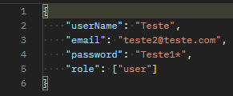
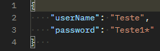
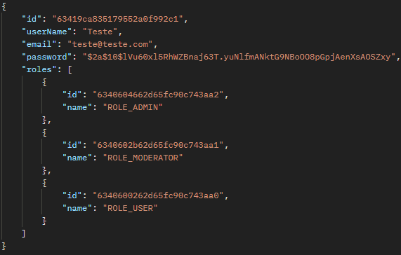
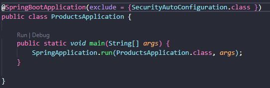

# Produtos

## Descrição Geral

Api para realizar cadastro de produtos, onde cada  produto possuirá nome e preço. Haverá produtos importados que terão taxa de alfandega e produtos usados que terão data de fabricação.

<p>Projeto adaptado com o intuito do estudo do framework Spring Boot.</p>

### Descrição do projeto:

O projeto consiste em fazer uma api utilizando o [Spring Boot](https://code.visualstudio.com/docs/java/java-spring-boot) com todas as relações **CRUD** utilizando o serviço de *cloud* do banco de dados **MongoDB** o [MongoDB Atlas](https://www.mongodb.com/cloud/atlas/register) satisfazendo a problemática acima.

O sistema foi incrementado com um sistema de **autenticação** utilizando o **Json Web Token**, na criação de tokens para identificação de usuários e também com rotas da aplicação protegidas.

Os usuários terão que respeitar três perfis, **roles**:
- **admin**: Administrador;
- **mod**: Moderador;
- **user**: Usuário / Cliente;

Projeto inspirado em uma atividade da aula 162 do curso [Java COMPLETO Programação Orientada a Objetos +Projetos
](https://www.udemy.com/course/java-curso-completo/), ministrado pelo professor Nélio Alves.

### EndPoints do projeto:
#### Para o cadastro, login e logout de usuário:
- Cadastrar usuário: /api/user/register [POST]



- Logar usuário: /api/user/login [POST]



- Listar usuário: /api/user/ [GET]




#### Para os produtos:
- Cadastro: /api/products/register [Post]

``` Json Body
{
    "name": "string",
    "price": "Double",
}
```
- Listar: /api/products/ [GET]
- Remover: /api/products/remove/{id} [DELETE]
- Atualizar: /api/products/update/{id} [PUT]
``` Json Body
{
    "name": "string",
    "price": "Double"
}
```

#### Produtos Importados:

- Cadastro: /api/products/imported/register [Post]

``` Json Body
{
    "name": "string",
    "price": "Double",
    "customsFee": "Double"
}
```
- Listar: /api/imported/ [GET]
- Remover: /api/products/imported/remove/{id} [DELETE]
- Atualizar: /api/products/imported/update/{id} [PUT]
``` Json Body
{
    "name": "string",
    "price": "Double",
    "customsFee": "Double"
}
```
#### Produtos Usados:

- Cadastro: /api/products/used/register [Post]

``` Json Body
{
    "name": "string",
    "price": "Double",
}
```
- Listar: /api/products/used/ [GET]
- Remover: /api/products/used/remove/{id} [DELETE]
- Atualizar: /api/products/used/update/{id} [PUT]
``` Json Body
{
    "name": "string",
    "price": "Double"
}
```

### Descrição da Api
#### Executar Api Remotamente:
- Link do Deploy: https://approducts.herokuapp.com/

#### Executar Api localmente:
- Para clonar o projeto: git clone https://github.com/TaylanTorres09/products-back.git
- Para Executar o projeto precisasse:
    - Java [JDK](https://www.oracle.com/java/technologies/downloads/#java17). Este projeto está usando a versão 17.
    - Banco [MongoDB Atlas](https://www.mongodb.com/cloud/atlas/register).

- Extensões do vscode utilizadas:
    - [Debugger for Java](https://marketplace.visualstudio.com/items?itemName=redhat.java)
    - [Spring Boot Extension Pack](https://marketplace.visualstudio.com/items?itemName=Pivotal.vscode-boot-dev-pack)
    - [Lombok Annotations Support for VS Code](https://marketplace.visualstudio.com/items?itemName=vscjava.vscode-lombok)

- Na pasta src/main, execute o arquivo PaymentApplication.java



- Para testar a api você pode utilizar ferramentas de client como:
    - [Postman](https://www.postman.com/)
    - [Insomnia](https://insomnia.rest/download)
    - Extensão do VsCode [Thunder Client](https://marketplace.visualstudio.com/items?itemName=rangav.vscode-thunder-client)
    - Ou outra de sua preferência.

### Próximos Passos
- Ainda no cadastro fazer verificação por email com geração de código de validação | serviços de mensageria.
- Criar sessão por usuário.

## Autor
<a href="https://www.linkedin.com/in/taylan-torres" target="_blank"></a> 
