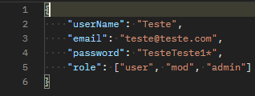

# Produtos

## Descrição Geral

Projeto inspirado em uma atividade da aula 162 do curso [Java COMPLETO Programação Orientada a Objetos +Projetos
](https://www.udemy.com/course/java-curso-completo/), ministrado pelo professor Nélio Alves.

Projeto adaptado com o intuito do estudo do framework Spring Boot.

### Descrição do projeto:

Api para realizar cadastro de produtos, onde cada  produto possuirá nome e preço. Haverá produtos importados que terão taxa de alfandega e produtos usados que terão data de fabricação.

O projeto consiste em fazer uma api utilizando o [Spring Boot](https://code.visualstudio.com/docs/java/java-spring-boot) com todas as relações **CRUD** utilizando o serviço de *cloud* do banco de dados **MongoDB** o [MongoDB Atlas](https://www.mongodb.com/cloud/atlas/register) satisfazendo a problemática acima.

O sistema foi incrementado com um sistema de **autenticação** utilizando o **Json Web Token**, na criação de tokens para identificação de usuários e também com rotas da aplicação protegidas.

Os usuários terão que respeitar três perfis, **roles**:
- **admin**: Administrador;
- **mod**: Moderador;
- **user**: Usuário / Cliente;

### EndPoints do projeto:
#### Para o cadastro, login e logout de usuário:
- Cadastrar usuário: /api/user/register [POST]

- Logar usuário: /api/user/login [POST]

- Logout usuário: /api/user/logout

#### Para os produtos:
- Listar todos os produtos: /products/
- Cadastro de Produtos: /products/register
- Listar todos os produtos **importados**: /products/imported/
- Cadastro de Produtos **Importados**: /products/imported/register
- Listar todos os produtos **usados**: /products/used/
- Cadastro de Produtos **Usados**: /products/used/register

### Descrição da Api
#### Executar Api Remotamente:
- Link do Deploy:

#### Executar Api localmente:
- Para clonar o projeto: git clone https://github.com/TaylanTorres09/products-back.git
- Para Executar o projeto precisasse:
    - Java [JDK](https://www.oracle.com/java/technologies/downloads/#java17). Este projeto está usando a versão 17.
    - Banco [MongoDB Atlas](https://www.mongodb.com/cloud/atlas/register).

- Extensões do vscode utilizadas:
    - [Debugger for Java](https://marketplace.visualstudio.com/items?itemName=redhat.java)
    - [Spring Boot Extension Pack](https://marketplace.visualstudio.com/items?itemName=Pivotal.vscode-boot-dev-pack)
    - [Lombok Annotations Support for VS Code](https://marketplace.visualstudio.com/items?itemName=vscjava.vscode-lombok)

- Configurar variáveis do Banco de Dados.

- Na pasta src/main, execute o arquivo PaymentApplication.java

- Para testar a api você pode utilizar ferramentas de client como:
    - [Postman](https://www.postman.com/)
    - [Insomnia](https://insomnia.rest/download)
    - Extensão do VsCode [Thunder Client](https://marketplace.visualstudio.com/items?itemName=rangav.vscode-thunder-client)
    - Ou outra de sua preferência.

### Próximos Passos
- Adicionar autenticação | cadastro de usuário da api.
- Ainda no cadastro fazer verificação por email com geração de código de validação | serviços de mensageria.
- Criar sessão por usuário.

## Autor
